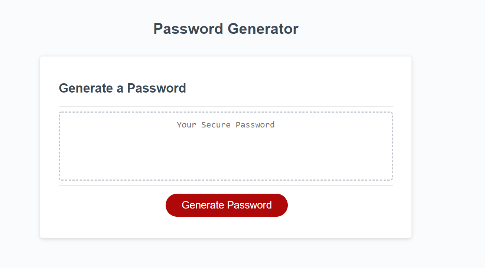

# Project Name
> password-generator

## Table of contents
* [General info](#general-info)
* [Screenshots](#screenshots)
* [Setup](#setup)
* [Status](#status)
* [Contact](#contact)

## General info
this is a simple program designed using javascript and HTML, where on loading of the webpage, the user is prompted with various queries that will generate a random password string between 8 and 128 characters. The password string may include specials, uppers, lowers, and numbers. This is a great program to use if you're having trouble writing various passwords for all your online accounts. Just make sure you save them somewhere!

## Screenshots



## Setup
This program runs in browser. There is no installation needed.

## Code Examples
Show examples of usage:
```
// confirm if user wants lower-case characters
  var lowerChars = confirm ("do you want lower-case letters?")
  if (lowerChars){
    // if yes, add all lower-case characters to password array
    for (j = 0 ; j < lowerCase.length; j++){
      passwordInfo.push(lowerCase[j]);

    }
  }
  ```


## Status
Project is in progress. Feel free to email me with any suggestions or to report any bugs: ianmharris93@gmail.com


## Contact
Created by Ian Harris(https://github.com/iannm93) - ianmharris93@gmail.com - feel free to contact me!
